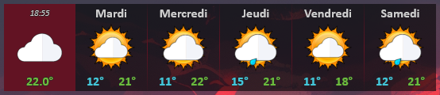
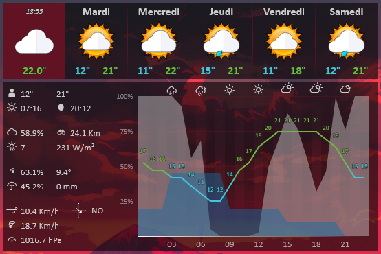

# \[Rainmeter\] VCWeather

VCWeather is a widget made for [Rainmeter](https://www.rainmeter.net/) on Windows which displays 5 days weather forecast:

**The weather forecast is provided by the [Visual Crossing API](https://www.visualcrossing.com/weather-api/)**

---

## Usage:

The colored square corresponds to the current weather conditions. The small clock on top indicates the latest forecast update.

You can view more information by hovering over each area:

---

## Installation:

You obviously need to install **Rainmeter** first.

Download and install the **VCWeather.rmskin** by double-clicking it  

> If you prefer to install it manually, download the widget files to **Documents/Rainmeter/Skins/VCWeather**.  
> And install the **SysColor.dll** plugin made by *Brian Ferguson* from his GitHub repository: [brianferguson/SysColor.dll](https://github.com/brianferguson/SysColor.dll/)

---

## Configuration:

Open the [Visual Crossing](https://www.visualcrossing.com/) website and create a free account to get your **API key**

Open **Settings.inc** located inside the **@Resources** directory and edit the following lines:

- **ApiKey=** your API key
- **Latitude=** and **Longitude=** use internet to find your coordinates (ex: Google maps)
- **Lang=** ar (Arabic), bg (Bulgiarian), cs (Czech), da (Danish), de (German), el (Greek Modern), en (English), es (Spanish) ), fa (Farsi), fi (Finnish), fr (French), he (Hebrew), hu, (Hungarian), it (Italian), ja (Japanese), ko (Korean), nl (Dutch), pl (Polish), pt (Portuguese), ru (Russian), sk (Slovakian), sr (Serbian), sv (Swedish), tr (Turkish), uk (Ukranian), vi (Vietnamese), zh (Chinese)
- **Units=** us, uk, metric, base (see [documentation](https://www.visualcrossing.com/resources/documentation/weather-api/unit-groups-and-measurement-units/))
- **MonitorOrientation=** if your screen remains stationary, take a compass, point it at your screen, and note the number displayed. The small compass rose and wind direction will be reoriented based on your actual position.
- **BgAlpha=** widget background transparency (0 = 100% transparent, 255 = 100% opaque)
- **ColorTemp...=** colors used for each temperature step
- **BelowIsTemp...=** temperature threshold for each color. Modify or convert to Fahrenheit if necessary

---

## Translation:

- **Days:** open **SetDaysTitle.lua** located in the **@Resources/Scripts/** directory and edit the **local days** line

> `local days = {"Dimanche","Lundi","Mardi","Mercredi","Jeudi","Vendredi","Samedi"}`

- **Wind direction:** open **SetDetailsText.lua** located in the **@Resources/Scripts/** directory and edit the **GetWindDirTxt** function

> `return "SO"` (Sud Ouest in French) becomes `return "SW"` (South West in English)

---

## Credits and Third-Party Licenses:

**Widget:** Licensed under GNU GPLv3 by HellPC

**SysColor.dll:** Licensed under GNU GPLv2 or later (GPLv2+) by [Brian Ferguson](https://github.com/brianferguson/SysColor.dll/)

**Weather Icons font:** By [Erik Flower](https://erikflowers.github.io/weather-icons/)
- Font: [SIL OFL 1.1](http://scripts.sil.org/OFL)
- Code: [MIT License](http://opensource.org/licenses/mit-license.html)
- Documentation: [CC BY 3.0](http://creativecommons.org/licenses/by/3.0/)

**icofont:** By [Ollyo](https://www.icofont.com/)
- Font: [CC BY 4.0](https://creativecommons.org/licenses/by/4.0/)
- Other: [MIT License](http://opensource.org/licenses/mit-license.html)

**Weather icons:** The icons provided in this widget are a mix of untouched ones found on random free png websites years ago, some I modified, and some I created from scratch.  
I apologize if you recognize your work, but I have absolutely no memory of their origin. If you want to regain credit or have them removed, please contact me.

**Weather data provider:** [Visual Crossing](https://www.visualcrossing.com/)
